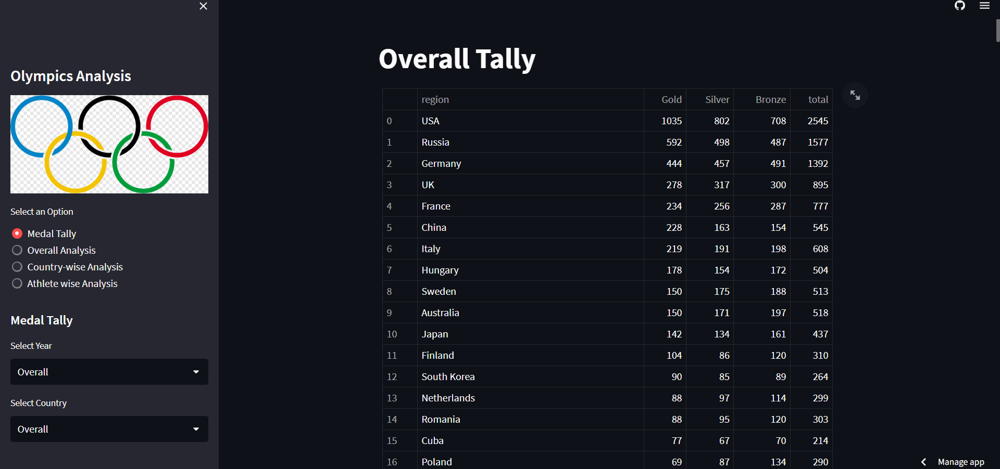

# Olympic-Data-Analysis

**Olympic web app project link deployed on Streamlit**

[click here to go to web app](https://olympic-data-analysis-tg7gn7ukltrmvinbawutdi.streamlit.app/))

**web app ui image**

**Dataset Link i used for analysis**
[dataset link](https://www.kaggle.com/datasets/heesoo37/120-years-of-olympic-history-athletes-and-results)

**Project Overview**

Welcome to my comprehensive data analysis project centered around the Olympic Games, spanning from 1896 to 2016. This project delves into the fascinating world of historical Olympic data, highlighting crucial insights and overcoming the complexities presented by newly formed countries throughout the 20th century and the disparities in male and female participation. The analysis aims to uncover patterns, trends, and stories hidden within the vast array of Olympic records.

**Data Quality Challenges**

One of the key challenges in this project was dealing with the intricacies arising from the changing geopolitical landscape. The 20th century saw the emergence of numerous new countries, leading to data inconsistencies. Overcoming this challenge required meticulous data preprocessing to ensure accurate analysis and visualizations. Additionally, addressing the gender disparity in participation required thoughtful consideration to ensure fair and accurate representation in the final insights.

**Utilizing Seaborn for Visualization**

To bring the data to life, I employed the Seaborn library to create visually appealing and informative visualizations. Seaborn's powerful capabilities allowed me to convey complex information in an easily understandable format. The visualizations provide insights into medal distributions, performance trends, and historical developments, enhancing the overall storytelling of the project.

**Data Manipulation with Pandas**

Pandas played a pivotal role in this analysis by facilitating efficient data manipulation and exploration. I harnessed its capabilities to clean the data, handle null values, and perform calculations that contributed to the project's insights. By skillfully employing Pandas, I could focus on deriving meaningful insights rather than grappling with data wrangling.

**Building an Interactive Streamlit App**

To make the analysis accessible and engaging, I designed a sophisticated Streamlit app that allows users to delve into the findings with a simple click. This professional user interface provides an interactive environment for users to explore visualizations, scrutinize trends, and gain insights tailored to their interests. The Streamlit app enhances the project's impact by enabling users to engage with the data directly.

**Conclusion**

This project stands as a testament to the power of data analysis in uncovering stories within historical data. By addressing complex challenges, utilizing cutting-edge libraries, and designing an interactive app, I have created a comprehensive exploration of Olympic history. Whether you're intrigued by the rise of new nations or the evolution of gender equality in sports, this project offers a rich tapestry of insights waiting to be discovered.

**Libraries used**
- Pandas
- Numpy
- seaborn
- matplotlib
- plotly
- streamlit
